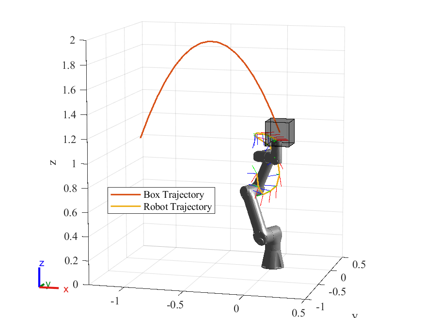

# GA-DDP

A differential dynamic programming algorithm based on geometric algebra, considering the complete dynamics of robots.

<p align = "center">


</p>


## 1. Introduction


GA-based DDP algorithm for robotic optimal control, offering a geometric perspective and computational efficiency. Validated in simulations and experiments.

## 2. Quick Start

Compiling tests passed on Ubuntu 22.04 with ROS2 Humble installed. You can just execute the following commands one by one.

```shell
sudo apt-get install libeigen3-dev
git clone git@github.com:Chen-WH/ga-ddp.git
cd ga-ddp
colcon build
source install/setup.bash
ros2 run ga-ddp iLQR_robot_test
```

## 3. Folder Structure

- benchmark: Benchmark testing code for the proposed method and other algorithms (Note: The SVA algorithm requires downloading [spatial_v2_extended](https://github.com/ROAM-Lab-ND/spatial_v2_extended)).
- description: Robot description files.
- images: Some saved results.
- include: Header files for the ga-ddp library.
- src: Source code files for the ga-ddp library.
- tests: Test programs and some examples for the ga-ddp library.

## 4. Highlights

### A Geometric Perspective

| $SE(3)$ metric task: flying box capture | GA element task: dual robot calibration |
| :---------: | :---------: |
|     |       |

Leveraging GA’s mathematical properties, our approach is compatible with Lie groups and Lie algebra, dual quaternion, and other geometric tools, making it applicable to various robotic problems.

### High Efficiency


The results indicate that the GA-based algorithm achieves speedup factors of 1.32×, 1.26×, and 1.10× over SVA for FD, FD-FO, and FD-SO, respectively, while achieving 2.32×, 1.73×, and 1.69× speedups over POE.
